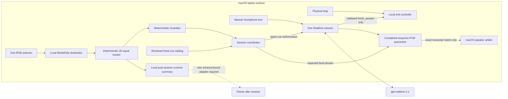
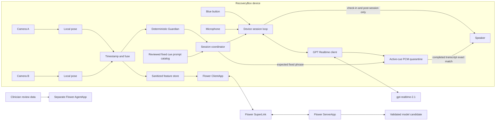

# RecoveryBox architecture

RecoveryBox has a runnable macOS laptop squat composition and a target
Raspberry Pi/two-camera composition. They share the deterministic Guardian,
fixed cue catalog, Realtime quarantine gate, and post-session Flower boundary;
they do not share camera assumptions. The system has three runtime parts:

1. an always-on edge runtime for immediate interaction and safety;
2. a Flower application for discrete federated training rounds; and
3. a separate, read-only Flower AgentApp for clinician review.

## Runnable laptop squat composition

The laptop demo composes one RGB webcam, the explicitly installed MediaPipe
Pose Landmarker Lite model, deterministic image-plane squat tracking, the
Guardian, macOS microphone/speaker adapters, and one persistent Realtime
WebSocket. The model file and native Python dependency pins are documented in
[the laptop runbook](laptop-squat-demo.md).

MediaPipe landmarks and frames remain process-local. The tracker emits derived
phase, projected knee angle, confidence, repetition count, arms-in-T state,
closed event IDs, and assessment issues. A low-confidence, stale, missing,
out-of-frame, geometrically invalid, or inconsistent result is non-assessable
and cannot advance a repetition.

This composition has one camera and uses `x`/`y` image-plane geometry. It has
no depth, anatomical 3D angle, world-coordinate, force, or cross-camera
agreement measurement. Camera placement, perspective, self-occlusion,
lighting, and clothing can affect the projection. The resulting squat tracker
is a configured hackathon state machine, not a general or clinical movement
assessment.

## Target Pi composition

## Runtime ownership

### Target Pi edge runtime

The edge runtime owns both cameras, pose estimation, timestamp alignment,
movement scoring, the Guardian, the physical button, audio capture/playback,
and the live Realtime connection. It continues to count, pause, and stop safely
when an internet or Flower service is unavailable. Exercise-cue speech is the
exception: it needs a working Realtime connection and is unavailable while the
device is offline.

Camera workers emit numeric pose summaries. Frame objects and encoded image
bytes are not part of the inter-process message type and are released after
pose extraction. The accepted summary is a versioned, exact three-angle vector
in the order prescribed-knee, prescribed-hip, and trunk flexion. A missing peer
camera cannot leave assessment pending forever: a monotonic watchdog emits a
closed missing-view result.

### Realtime conversation

`gpt-realtime-2.1` provides server-to-server, speech-to-speech conversation over
a WebSocket. Audio is signed 16-bit little-endian mono PCM at 24 kHz. Turns are
manual: the Pi uses its button and the laptop composition supplies an explicit
capture action. On the Pi, a press begins capture, release commits the buffer,
and a press during playback cancels/truncates the prior response before a new
turn.

The laptop workout opens one WebSocket, sends one session configuration, and
reuses that session for all manual input turns and prompt cues. Cue responses
set `conversation: "none"` so they are isolated from conversational history,
but they still travel over the same socket. A completed repetition, tenth rep,
pause, silence, or ordinary response does not close it. Normal session end is
limited to a physical stop or a locally validated, argument-free
`finish_session` tool call. Provider/transport failure may force cleanup, but
is not treated as user intent to finish.

Client events pass through one bounded, ordered sender worker. Guardian
decisions and physical stop therefore never write to the socket inline.
Backpressure or an asynchronous write failure closes the cloud lane
fail-closed while local pose processing and stop behavior continue.

Official OpenAI documentation caps a Realtime session at 60 minutes. The
single-connection laptop demo therefore supports workouts shorter than that
cap; it has no unverified seamless-rotation claim.

There are two audible-output lanes:

- `CHECK_IN` and `POST_SESSION` can use conversational streaming. That is a
  protocol lane, not a claim of measured provider latency in this environment.
- `ACTIVE_EXERCISE` blocks ordinary model speech. Fixed cue phrases live in a
  versioned, clinician-reviewed prompt catalog, and only the local Guardian may
  select a cue ID. That selection creates an isolated Realtime response prompt
  requiring exactly the catalog phrase. The returned PCM is collected in
  quarantine and cannot stream to the speaker. It is released only after the
  response is complete and its completed transcript exactly matches the fixed
  phrase. Missing, partial, canceled, or mismatched transcripts discard the
  PCM.

There is no exercise fallback through a speech-generation endpoint,
operating-system TTS, generic model speech, or prerecorded cue. If the one
Realtime connection is unavailable, the Guardian-selected cue is silent and
the session pauses cloud coaching without weakening local analysis or stop.

Realtime function arguments are validated locally. A tool call may request a
more cautious Guardian action, but cannot make a decision less cautious.
Validated tool calls are idempotent by call ID. A canceled response leaves a
fail-closed ordering tombstone so a late server response cannot consume the
next turn's speaker authorization.

### Guardian

The Guardian is a deterministic, versioned rule engine. Its closed output is
`CONTINUE`, `CUE`, `PAUSE`, `STOP`, or `ESCALATE`, plus reason codes and an
optional reviewed cue ID. Priority is deliberately conservative:

1. pain, emergency, or an explicit stop request;
2. stale/missing evidence, poor visibility, or camera disagreement;
3. plan and reviewed cue-prompt constraints;
4. movement feedback;
5. continue.

The federated model can score movement quality. It cannot alter the prescribed
exercise, thresholds, contraindications, repetition target, or Guardian rules.
Camera disagreement and its plan threshold are represented in degrees from
fusion through Guardian evaluation; there is no implicit unit conversion.

### Session coordinator

The edge session coordinator owns the product mode and is the composition
boundary between Guardian decisions, Realtime, and the physical speaker. It
preempts model audio on every restricted mode transition. In active exercise,
the only audible capability contains a Guardian-selected cue ID and
prompt-catalog/rule metadata; it contains neither generated PCM nor free-form
text. The Realtime cue path resolves that ID to its fixed phrase, asks
`gpt-realtime-2.1` for that exact response in isolation, and holds all returned
PCM until the completed transcript exactly matches. `PAUSE`, `STOP`, and
`ESCALATE` are silent in this prototype and synchronously close model audio.
The laptop composition connects this path to one macOS speaker arbiter; doing
the same in the long-running Pi service remains part of its hardware slice.

The same local end controller accepts exactly two typed capabilities: physical
stop and a `finish_session` call already validated by the one-tool registry.
It does not accept raw Realtime JSON, transcripts, free-form model text, or rep
completion as authority to close the socket and devices.

### Flower federation

The Flower ClientApp is ephemeral. It runs after a session, reads a snapshot of
the sanitized numeric feature store, performs local training, and participates
in a three-client SecAgg+ round. It never owns a camera, microphone, speaker,
button, or Realtime session.

The active laptop squat loop sends no Flower messages. Its local summaries may
cross into a future Flower job only through a post-session, allowlisted numeric
adapter. The current FAB is signed for `seated-knee-extension`, not `squat`, so
its exercise, label, and model-schema checks must reject laptop squat records.

For Flower 1.34, the project follows the documented SecAgg+ compatibility lane:
`secaggplus_mod` on each NumPyClient and `SecAggPlusWorkflow` around the server
fit workflow. The hackathon demonstrates the mechanism with three local
SuperNodes; it does not claim production anonymity, robustness, or clinical
validity from such a small cohort.

The aggregate is a candidate. A separate promotion boundary must validate its
feature schema, exercise ID, held-out metrics, and signature before any device
can install it. Devices retain the previous version for rollback.

The model signature binds the exact exercise, feature schema and normalization
ranges, label meanings, model family, and parameter shapes. Client records and
round configuration must carry the same exercise ID, label-definition version,
and signature. A local training set larger than the SecAgg+ `max-weight` limit
is rejected before fitting.

### Clinician AgentApp

Flower allows an AgentApp FAB or a ServerApp/ClientApp FAB, not all three in one
FAB. The clinician assistant therefore lives in its own project. It reads
de-identified summaries and produces a review queue with cited evidence. The
prototype has no model presentation layer, device-control,
prescription-change, or diagnostic tool; validated deterministic Markdown is
the authoritative output.

## Data contracts

| Boundary | Allowed | Forbidden |
|---|---|---|
| Camera worker to edge loop | joint angles, timestamps, confidence, view ID | images, encoded frames |
| Laptop tracker to Guardian | derived squat state, confidence, event and issue IDs | images, landmarks, audio, phrases |
| Edge loop to feature store | derived windows, exercise code, quality label, schema version | names, patient IDs, audio, transcript |
| Flower messages | model arrays and numeric metrics | raw media, free text, identifiers |
| Clinician AgentApp | de-identified session summaries and evidence codes | direct device commands |

## Failure behavior

- Camera loss, stale pose, low confidence, or view disagreement makes the
  movement non-assessable and pauses coaching.
- Realtime loss ends cloud conversation and makes exercise-cue speech
  unavailable, but leaves local pose, Guardian, button, pause, and stop paths
  available and fail-safe.
- The exercise path has no TTS or generic-speech fallback after Realtime loss.
- A completed set never closes the laptop session; only physical stop or a
  validated `finish_session` capability performs the normal end cleanup.
- A missing or non-exact completed cue transcript discards all quarantined PCM;
  it never falls through to ordinary active-exercise speech.
- Playback failure stops queued output and returns the device to a safe error
  state; recording and playback never overlap. Connectivity recovery is an
  explicit reset with a restored conversation port and successful cleanup.
- Flower failure leaves the currently installed model unchanged.
- Unknown schema or model dimensions are rejected before training or loading.

## Primary references

- [OpenAI gpt-realtime-2.1 model](https://developers.openai.com/api/docs/models/gpt-realtime-2.1)
- [OpenAI Realtime WebSocket guide](https://developers.openai.com/api/docs/guides/realtime-websocket)
- [OpenAI Realtime conversations](https://developers.openai.com/api/docs/guides/realtime-conversations)
- [Flower deployment runtime](https://flower.ai/docs/framework/1.34/en/how-to-run-flower-with-deployment-engine.html)
- [Flower secure aggregation example](https://flower.ai/docs/examples/flower-secure-aggregation.html)
- [Flower AgentApp runtime](https://flower.ai/docs/agent/explanations/agentapp-runtime.html)
